<p align="center">
  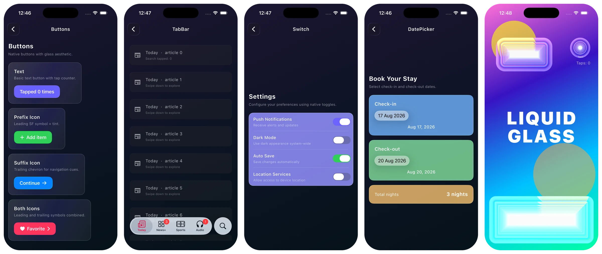
</p>

<h1 align="center">liquid_glass_native</h1>

<p align="center">
  <strong>Native Apple Liquid Glass UI for Flutter.</strong><br/>
  Real SwiftUI <code>glassEffect</code> widgets on iOS 26+ — buttons, tab bars, sliders, pickers, sheets and more — plus a cross-platform GPU shader lens. Not a <code>BackdropFilter</code> blur fake.
</p>

<p align="center">
  <a href="https://pub.dev/packages/liquid_glass_native"></a>
  <a href="https://pub.dev/packages/liquid_glass_native/score"></a>
  <a href="https://pub.dev/packages/liquid_glass_native"></a>
  <a href="https://pub.dev/packages/liquid_glass_native"></a>
  <a href="https://github.com/winterzxzz/flutter_native_view/blob/main/LICENSE"></a>
  
  
</p>

<p align="center">
  <a href="#-quick-start">Quick start</a> ·
  <a href="#-screenshots">Screenshots</a> ·
  <a href="#-widget-catalog">Widget catalog</a> ·
  <a href="#-cross-platform-shader-glass">Shader glass</a> ·
  <a href="#-theming--accessibility">Theming</a> ·
  <a href="#-platform-behavior">Platforms</a> ·
  <a href="#-faq">FAQ</a> ·
  <a href="https://pub.dev/documentation/liquid_glass_native/latest/">API docs</a>
</p>

---

**liquid_glass_native** brings Apple's **Liquid Glass** design language (introduced at WWDC25 with iOS 26) to Flutter. Every control is a real SwiftUI/UIKit view embedded through a platform view, so on iOS 26+ your app gets the *authentic* `glassEffect` material — the same refraction, specular highlights, touch reaction and `GlassEffectContainer` morphing as native apps. On older iOS versions and other platforms it degrades gracefully instead of breaking your build.

## ✨ Why liquid_glass_native?

- **🍎 Genuinely native.** Buttons, toggles, sliders, tab bars, sheets and pickers are rendered by SwiftUI, not painted in Dart. Liquid Glass samples the real native render tree and reacts to touch — a `BackdropFilter` can't do that.
- **📦 22+ ready-made widgets** with a Flutter-idiomatic API: `LiquidGlassButton`, `LiquidGlassTabBar`, `LiquidGlassSwitch`, `LiquidGlassSlider`, `LiquidGlassSheet`, `LiquidGlassDatePicker`, and more.
- **🌈 Cross-platform shader lens.** `LiquidGlass` / `LiquidGlassView` use a bundled fragment shader for refraction, chromatic aberration and highlights — Android, macOS, Windows, Linux and web, wherever Flutter fragment shaders run.
- **🎨 App-wide theming** with `LiquidGlassTheme` (tint, radius, label color, brightness, interactivity).
- **♿ Accessibility built in.** Honors iOS *Reduce Transparency* and *Reduce Motion* out of the box.
- **🛡️ Safe to ship today.** Deployment target stays at iOS 14; `glassEffect` is compiled behind `#available(iOS 26, *)` guards.
- **⚡ Zero-config sizing.** Controls negotiate their intrinsic size with the native side, so layouts just work.

## 🚀 Quick start

### 1. Install

```sh
flutter pub add liquid_glass_native
```

Or add it to `pubspec.yaml`:

```yaml
dependencies:
  liquid_glass_native: ^0.3.0
```

### 2. Requirements

| Requirement | Value |
| --- | --- |
| Flutter | `>= 3.3.0` |
| Dart | `^3.11.0` |
| iOS deployment target | `14.0` (Liquid Glass activates on iOS 26+) |
| Xcode | Xcode with the **iOS 26 SDK** to compile `glassEffect` |

Make sure `example/ios/Podfile` (or your app's Podfile) sets `platform :ios, '14.0'` or higher.

### 3. Use it

```dart
import 'package:liquid_glass_native/liquid_glass_native.dart';

class Demo extends StatefulWidget {
  const Demo({super.key});
  @override
  State<Demo> createState() => _DemoState();
}

class _DemoState extends State<Demo> {
  bool _wifi = true;
  int _tab = 0;

  @override
  Widget build(BuildContext context) {
    return Scaffold(
      body: Column(
        children: [
          LiquidGlassButton(
            label: 'Add to cart',
            leadingSymbol: 'cart',       // SF Symbol name
            tint: Colors.blue,           // optional glass tint
            onPressed: () {},
          ),
          LiquidGlassLabeledSwitch(
            label: 'Wi-Fi',
            value: _wifi,
            onChanged: (v) => setState(() => _wifi = v),
          ),
        ],
      ),
      bottomNavigationBar: LiquidGlassTabBar(
        items: const [
          TabItem(label: 'Home', sfSymbol: 'house'),
          TabItem(label: 'Inbox', sfSymbol: 'tray', badge: '3'),
        ],
        currentIndex: _tab,
        onTap: (i) => setState(() => _tab = i),
        accessorySymbol: 'magnifyingglass',   // detached glass search button
        onAccessoryTap: () =>
            LiquidGlassSheet.show(context: context, title: 'Search'),
      ),
    );
  }
}
```

That's it — run on an iOS 26 device or simulator and you get real Liquid Glass.

## 📸 Screenshots

Captured from the bundled example app on an iPhone 17 Pro simulator running **iOS 26.5** — every control below is a real SwiftUI view.

<table>
  <tr>
    <td align="center">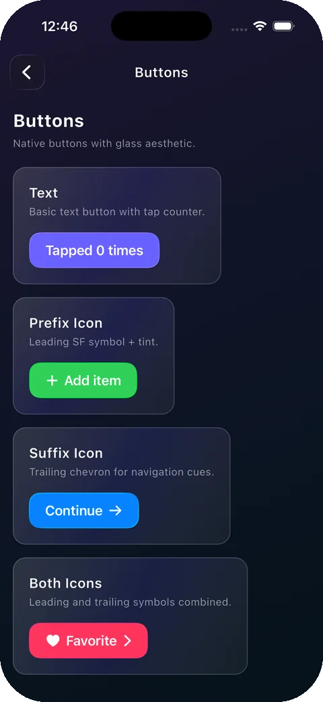<br/><sub><b>Buttons</b></sub></td>
    <td align="center">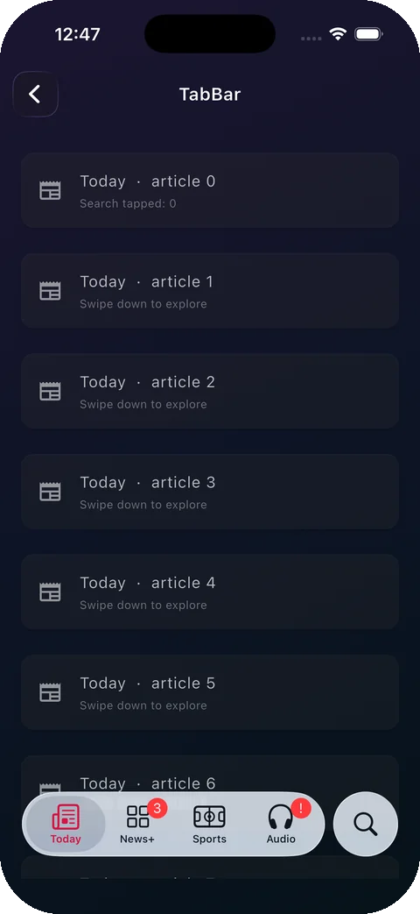<br/><sub><b>Tab bar</b></sub></td>
    <td align="center">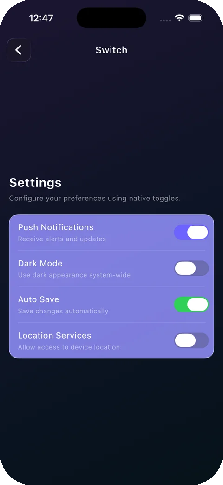<br/><sub><b>Switch</b></sub></td>
    <td align="center">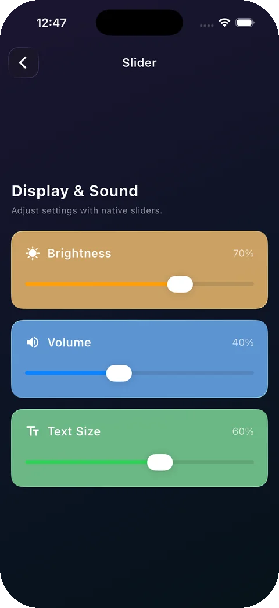<br/><sub><b>Slider</b></sub></td>
    <td align="center">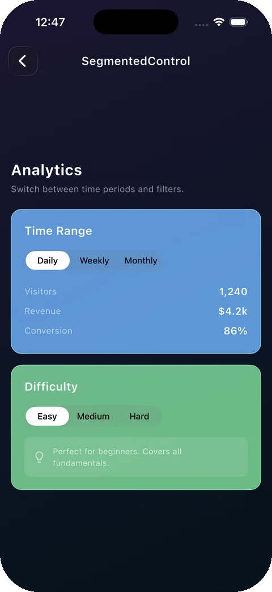<br/><sub><b>Segmented</b></sub></td>
  </tr>
  <tr>
    <td align="center">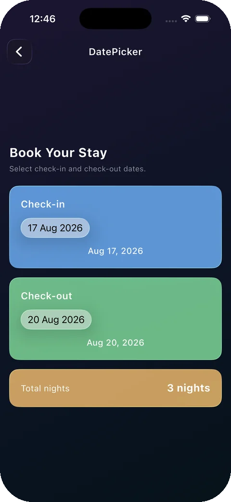<br/><sub><b>Date picker</b></sub></td>
    <td align="center">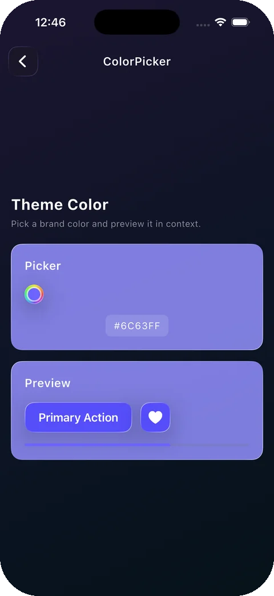<br/><sub><b>Color picker</b></sub></td>
    <td align="center">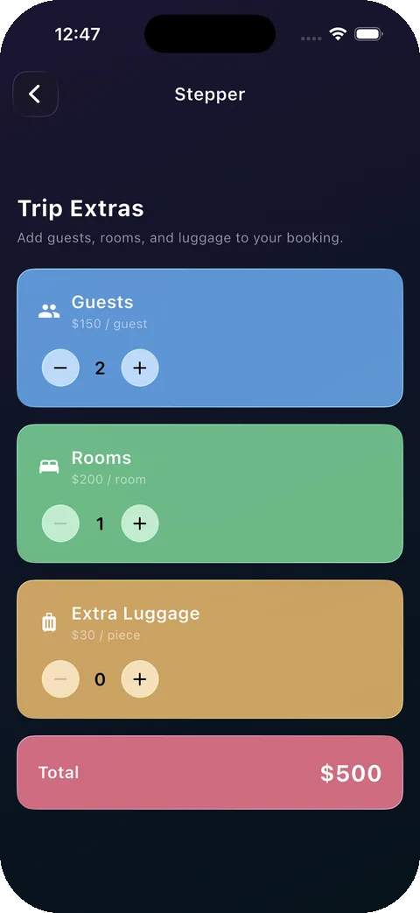<br/><sub><b>Stepper</b></sub></td>
    <td align="center">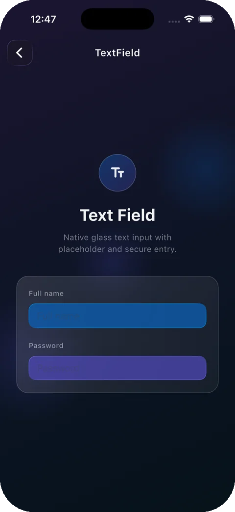<br/><sub><b>Text field</b></sub></td>
    <td align="center">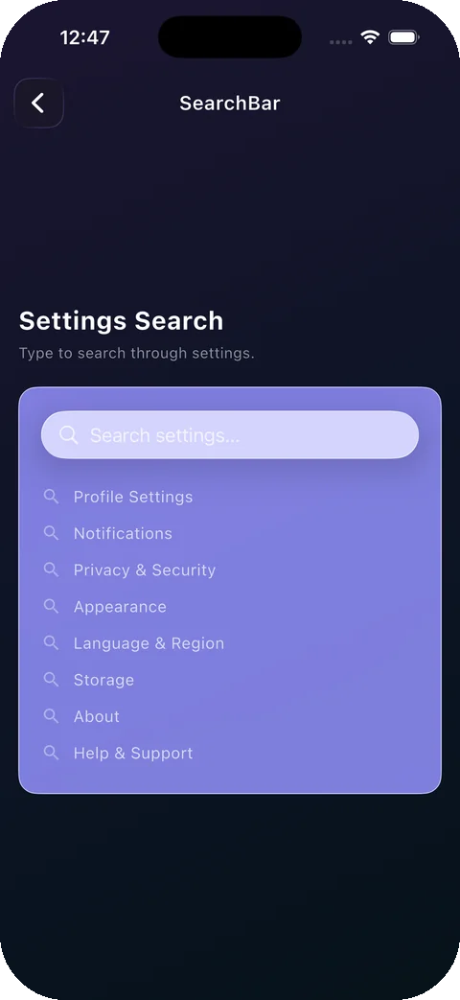<br/><sub><b>Search bar</b></sub></td>
  </tr>
  <tr>
    <td align="center">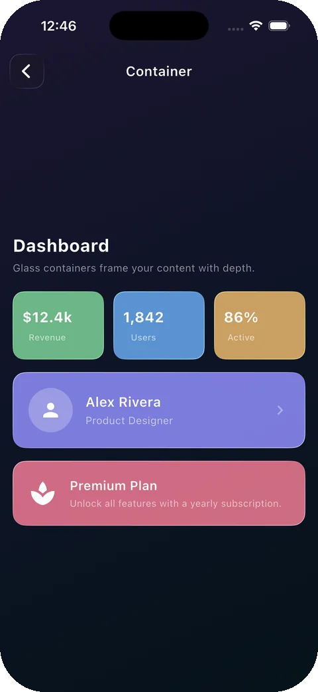<br/><sub><b>Container</b></sub></td>
    <td align="center">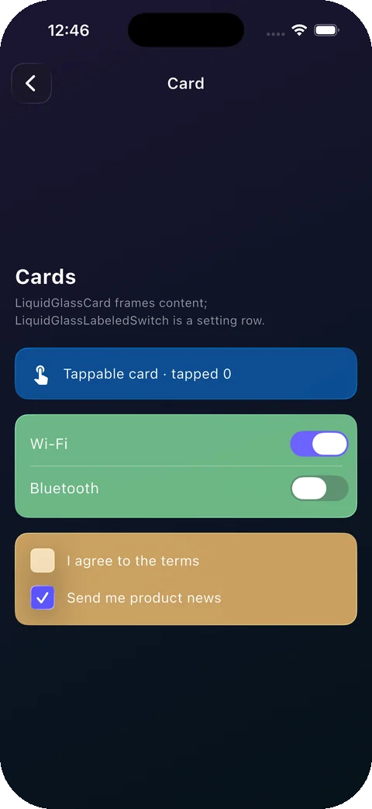<br/><sub><b>Card & checkbox</b></sub></td>
    <td align="center">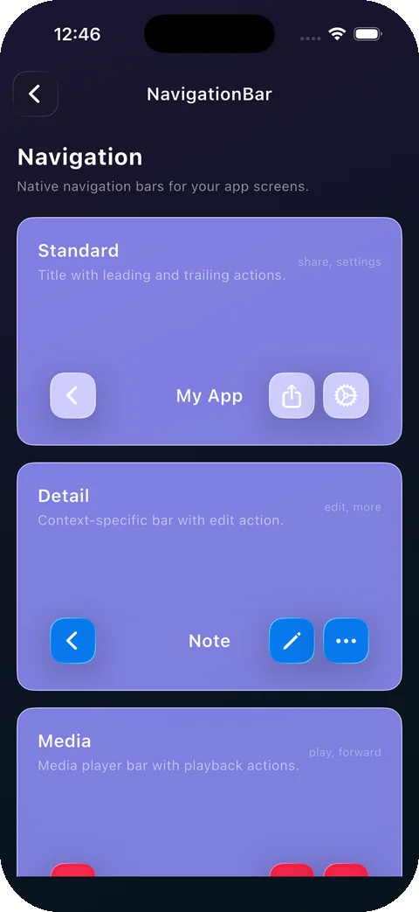<br/><sub><b>Navigation bar</b></sub></td>
    <td align="center">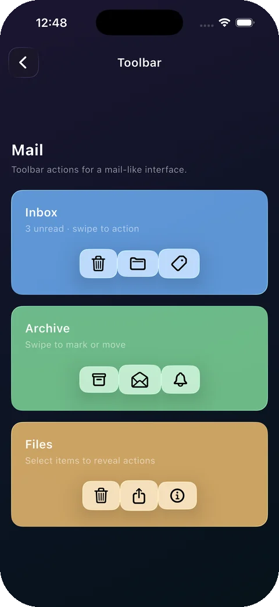<br/><sub><b>Toolbar</b></sub></td>
    <td align="center">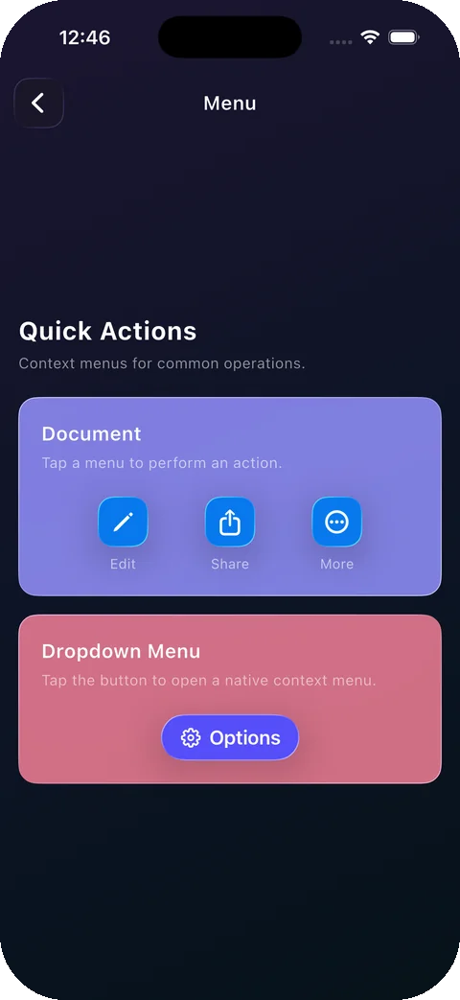<br/><sub><b>Menu</b></sub></td>
  </tr>
  <tr>
    <td align="center">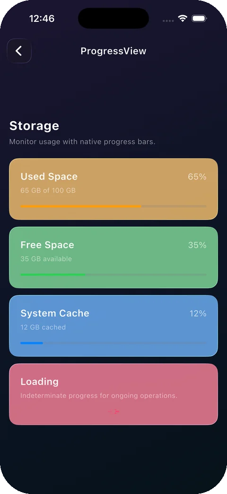<br/><sub><b>Progress</b></sub></td>
    <td align="center">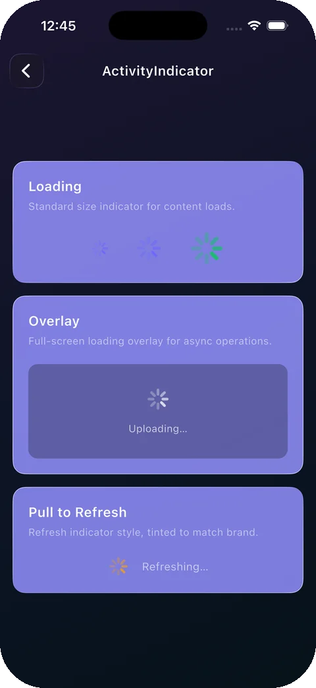<br/><sub><b>Activity indicator</b></sub></td>
    <td align="center">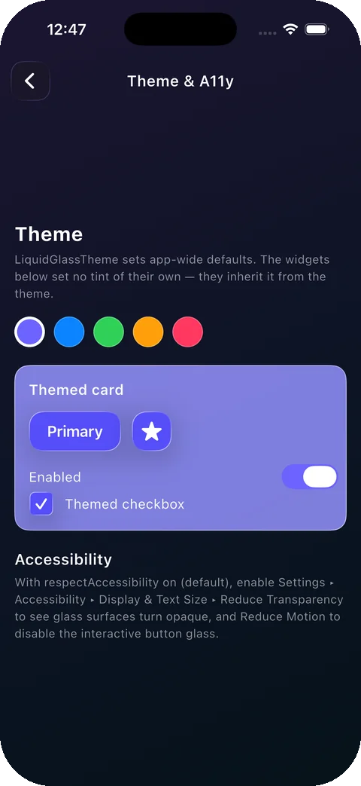<br/><sub><b>Theme & a11y</b></sub></td>
    <td align="center">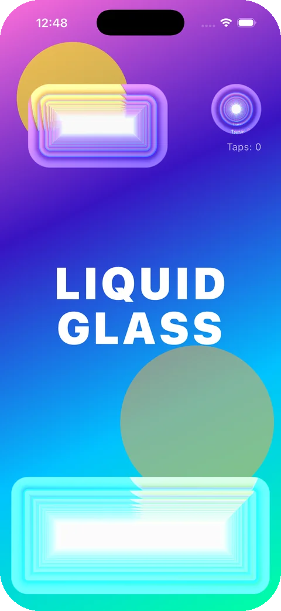<br/><sub><b>Shader glass</b></sub></td>
    <td align="center">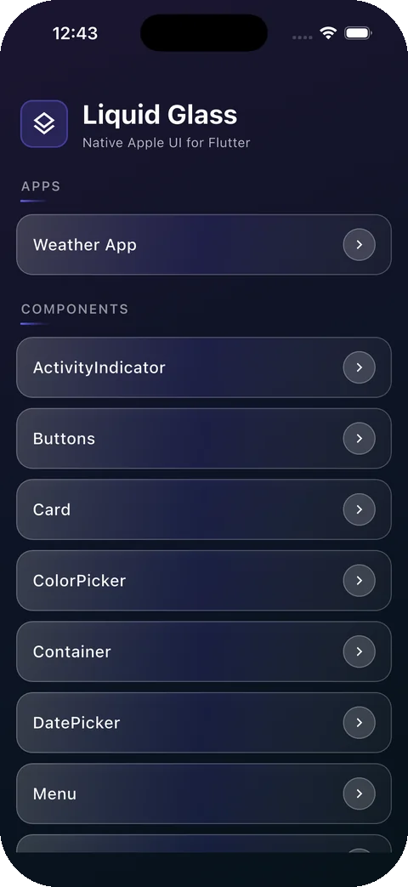<br/><sub><b>Example gallery</b></sub></td>
  </tr>
</table>

## 🧩 Widget catalog

All widgets are prefixed `LiquidGlass*` and exported from `package:liquid_glass_native/liquid_glass_native.dart`.

### Buttons & actions

| Widget | Description |
| --- | --- |
| `LiquidGlassButton` / `.heading` | Native glass button with optional leading/trailing SF Symbols. Auto-sizes via an intrinsic-size handshake. |
| `LiquidGlassIconButton` | Circular icon-only glass button (SF Symbol). |
| `LiquidGlassButtonGroup` | Row of glass buttons sharing one `GlassEffectContainer` (morphing glass). |
| `LiquidGlassMenu` | Native pull-down menu button with `MenuItem`s. |

### Controls & inputs

| Widget | Description |
| --- | --- |
| `LiquidGlassSwitch` | Native SwiftUI `Toggle`; state bridged back to Dart. |
| `LiquidGlassLabeledSwitch` | Label + switch settings row. |
| `LiquidGlassCheckbox` | Native glass checkbox with checkmark. |
| `LiquidGlassSlider` | Native SwiftUI `Slider` (eager gesture, parent width). |
| `LiquidGlassStepper` | Native SwiftUI `Stepper` with `min`/`max`/`step`. |
| `LiquidGlassSegmentedControl` | Native segmented control, theme-aware brightness. |
| `LiquidGlassTextField` | Native glass text input; placeholder, secure entry. |
| `LiquidGlassSearchBar` | Native search field with configurable text/icon/cursor colors. |

### Pickers

| Widget | Description |
| --- | --- |
| `LiquidGlassDatePicker` | Native SwiftUI `DatePicker` (date / time / dateAndTime). |
| `LiquidGlassColorPicker` | Native SwiftUI `ColorPicker`. |

### Surfaces & navigation

| Widget | Description |
| --- | --- |
| `LiquidGlassContainer` | Glass panel; pass any Flutter `child` to layer content on glass. |
| `LiquidGlassCard` | Padded, rounded glass card with optional `onTap`. |
| `LiquidGlassNavigationBar` | Native top bar with title + leading/trailing `BarAction`s. |
| `LiquidGlassTabBar` | Native tab bar with per-tab `badge`, search accessory and minimize-on-scroll. |
| `LiquidGlassToolbar` | Native bottom toolbar of `BarAction`s. |

### Feedback

| Widget | Description |
| --- | --- |
| `LiquidGlassProgressView` | Native linear `ProgressView`. |
| `LiquidGlassActivityIndicator` | Native circular spinner. |

### Modals

Presented natively through the shared presenter — call from any event handler:

```dart
await LiquidGlassSheet.show(context: context, title: 'Details');

final id = await LiquidGlassAlert.show(
  context: context,
  title: 'Delete file?',
  message: 'This cannot be undone.',
  buttons: const [
    AlertButton(id: 'cancel', label: 'Cancel'),
    AlertButton(id: 'delete', label: 'Delete', destructive: true),
  ],
);

await LiquidGlassPopover.show(context: context, title: 'Info');
```

## 🌈 Cross-platform shader glass

Need the Liquid Glass *look* on Android, web or desktop — or want to refract arbitrary Flutter content? `LiquidGlassView` captures its subtree to a texture every frame, and each `LiquidGlass` lens inside it runs a bundled fragment shader with configurable refraction, chromatic aberration, tint and specular highlight. Before the first capture (or where fragment shaders aren't available) it falls back to a frosted blur + tint.

```dart
LiquidGlassView(
  child: Stack(
    children: [
      const Positioned.fill(child: MyColorfulBackground()),
      Positioned(
        left: 40,
        top: 120,
        child: LiquidGlass(
          style: const LiquidGlassStyle(
            borderRadius: 32,
            refraction: 22,
            chromaticAberration: 4,
            highlight: 0.3,
          ),
          onTap: () {},           // press ripple
          child: const Padding(
            padding: EdgeInsets.all(16),
            child: Icon(Icons.favorite, color: Colors.white),
          ),
        ),
      ),
    ],
  ),
);
```

Try the standalone demo: `cd example && flutter run -t lib/main_shader.dart`.

## 🎨 Theming & accessibility

Wrap your app in a `LiquidGlassTheme` for app-wide defaults. Every widget resolves a value as **explicit parameter ?? theme ?? built-in default**.

```dart
LiquidGlassTheme(
  data: const LiquidGlassThemeData(
    tint: Color(0xFF0A84FF),
    borderRadius: 16,
    labelColor: Colors.white,
    brightness: Brightness.dark,
    interactive: true,          // touch-reactive glass
    respectAccessibility: true, // default
  ),
  child: const MyApp(),
);
```

With `respectAccessibility` on (the default), native glass honors the system **Reduce Transparency** setting (opaque surface) and **Reduce Motion** (no interactive touch response).

## 📱 Platform behavior

| Platform | What you get |
| --- | --- |
| **iOS 26+** | Authentic Liquid Glass — `glassEffect(.regular.interactive())`, `GlassEffectContainer` morphing, native touch reaction. |
| **iOS 16 – 25** | Standard SwiftUI controls and styling. |
| **iOS 14 – 15** | System UIKit/SwiftUI controls. |
| **Android · macOS · Windows · Linux · Web** | Material fallbacks for the native widgets; the shader `LiquidGlass` lens renders wherever Flutter fragment shaders run (frosted blur fallback otherwise). |

## 🔬 How it works

```text
Dart LiquidGlass* widget
  → UiKitView (platform view)
    → per-view FlutterMethodChannel  (<viewType>/<id>)
      → Swift FlutterPlatformViewFactory
        → SwiftUI / UIKit control with glassEffect
```

- The iOS plugin registers one `FlutterPlatformViewFactory` per control.
- A per-view method channel carries events (`onPressed`, `onChanged`) and updates (`updateConfig`, `setValue`).
- Controls whose native content determines their size reply to `getIntrinsicSize`; Flutter wraps the platform view in a matching `SizedBox`.

Read more in [`docs/ARCHITECTURE.md`](https://github.com/winterzxzz/flutter_native_view/blob/main/docs/ARCHITECTURE.md) and the [design history](https://github.com/winterzxzz/flutter_native_view/blob/main/docs/superpowers/specs/2026-06-24-liquid-glass-plugin-design.md) (native → Flutter shader → back to native).

## 🧪 Example app

The `example/` app is a full gallery of every widget plus a complete **Glass Weather** sample app built with the package.

```sh
cd example
flutter run                              # widget gallery + weather app
flutter run -t lib/main_shader.dart      # cross-platform shader demo
```

## ❓ FAQ

<details>
<summary><strong>Does Flutter support iOS 26 Liquid Glass?</strong></summary>
Not out of the box — Flutter's Cupertino widgets are drawn in Dart. <code>liquid_glass_native</code> embeds real SwiftUI views so you get Apple's actual <code>glassEffect</code> material inside a Flutter app.
</details>

<details>
<summary><strong>How is this different from glassmorphism / BackdropFilter packages?</strong></summary>
Blur-based packages approximate the look with a Gaussian blur over a Flutter texture. Real Liquid Glass refracts the <em>native</em> render tree, has specular highlights, morphs between elements in a <code>GlassEffectContainer</code>, and reacts to touch. This package uses the native material on iOS 26 and offers a shader-based lens elsewhere.
</details>

<details>
<summary><strong>Will my app still run on iOS 14–25?</strong></summary>
Yes. The deployment target is iOS 14.0 and all iOS 26 APIs are behind <code>#available</code> checks. Older systems render standard SwiftUI/UIKit controls.
</details>

<details>
<summary><strong>Does it work on Android / web / desktop?</strong></summary>
The native widgets fall back to Material equivalents so your code compiles and runs everywhere. For an actual glass look on those platforms use the shader-based <code>LiquidGlass</code> / <code>LiquidGlassView</code>.
</details>

<details>
<summary><strong>Why do I need the iOS 26 SDK if my minimum is iOS 14?</strong></summary>
Swift must be able to <em>compile</em> the <code>glassEffect</code> calls, even though they're only <em>executed</em> on iOS 26+. Any Xcode that ships the iOS 26 SDK works.
</details>

<details>
<summary><strong>Can I put Flutter widgets on top of native glass?</strong></summary>
Yes — <code>LiquidGlassContainer</code> and <code>LiquidGlassCard</code> accept any Flutter <code>child</code>, which is layered over the native glass surface.
</details>

## 🤝 Contributing

Issues and pull requests are welcome! If this package saved you time, a ⭐ on [GitHub](https://github.com/winterzxzz/flutter_native_view) and a 👍 on [pub.dev](https://pub.dev/packages/liquid_glass_native) help others discover it.

- 🐛 [Report a bug](https://github.com/winterzxzz/flutter_native_view/issues)
- 📝 [Changelog](https://github.com/winterzxzz/flutter_native_view/blob/main/CHANGELOG.md)
- 📚 [API reference](https://pub.dev/documentation/liquid_glass_native/latest/)

## 📄 License

MIT © [winterzxzz](https://github.com/winterzxzz). See [LICENSE](https://github.com/winterzxzz/flutter_native_view/blob/main/LICENSE).

---

<sub>Keywords: flutter liquid glass, liquid glass flutter package, iOS 26 flutter, glassEffect flutter, SwiftUI flutter plugin, native iOS widgets flutter, cupertino liquid glass, glassmorphism flutter, apple liquid glass ui, flutter platform view, WWDC25 design.</sub>
